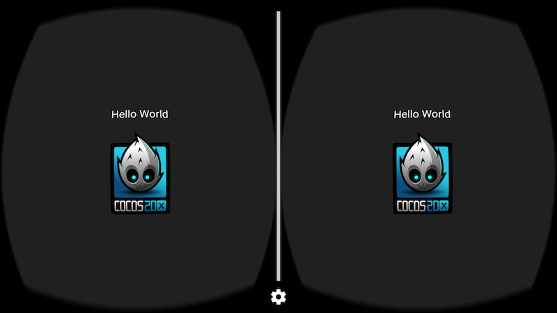
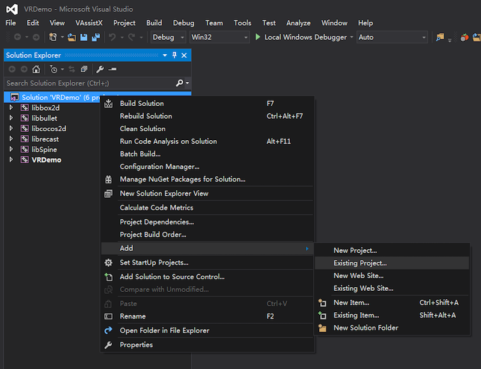
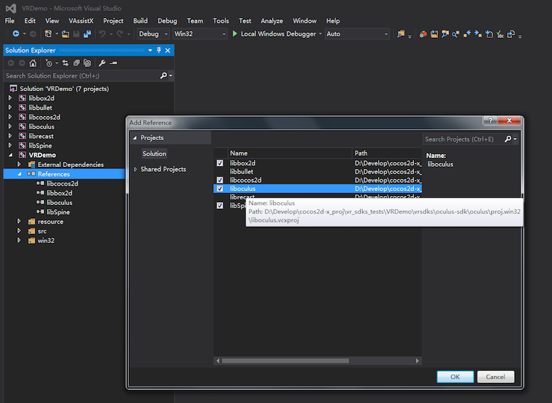
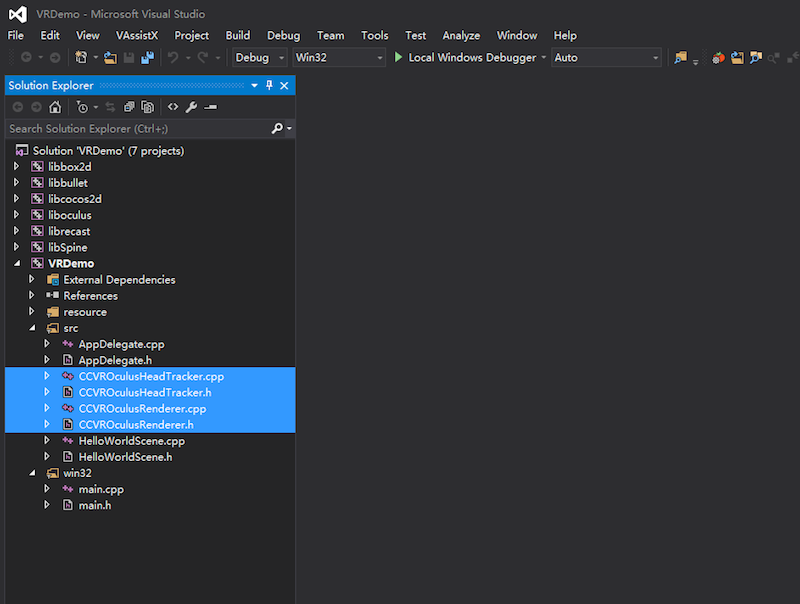
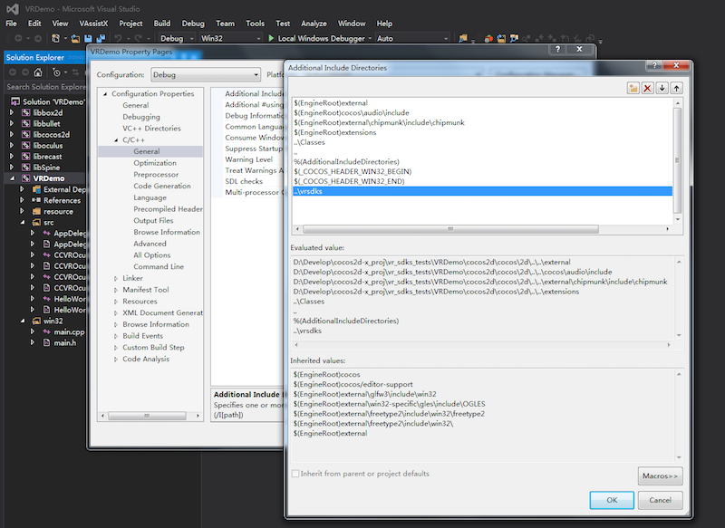

# Virtual Reality (VR)
You have probably heard the term __Virtual Reality__ or __VR__ used before.
__VR__ isn't new. Its roots can be traced back to earlier than the 1970's. The
original goal of __VR__ was to take an environment or situation, both realistic
and unrealistic and let the user feel what it is like to experience it by simulating
their physical presence in the environment. You can think of it as *transporting*
the user to another experience, all the while never leaving their physical surroundings.
You might even associate __VR__ with wearing a *head-mounted display* or special
gloves or even taking place on a special platform.

Modern __VR__ is focused around *games* and *immersive video*.

## Is VR production ready?
No, __VR__ is still in the early phases of development. Please consider it __experimental__!
In fact, we are providing a __generic renderer__ implementation to use as a
proof-of-concept. You can use this in a simulator or with a __Google Cardboard__
*head-mounted display*. You cannot trust the __generic renderer__ to produce 100%
correct results. It is always necessary to test with a supported SDK and
supported hardware.

We support the popular __VR SDKs__:

| SDK           |  Company       | Runtime Platform |
|---------------|----------------|------------------|
| GearVR        | Samsung        | Galaxy Note 5/S6/S6 Edge/S6 Edge+ |
| GVR(Cardboard And Daydream)           | Google         | Android 4.4 (KitKat) or higher  |
| DeepoonVR      | Deepoon        | Galaxy Note 5/S6/S6 Edge/S6 Edge+ |
| OculusVR       | Oculus         | Oculus Rift(Windows 7+) |

## Is your game a good VR candidate?
If, late on a Friday evening, after a night of dinner, dance and drink, you find
yourself thinking *__let me take my current game and turn it into a VR game__*.
Pause... longer... and make sure you are not dreaming! Seriously, you need to stop
and ask yourself a few questions:

  * How do I interact with the game currently? Touch? Gamepad? Keyboard?
  * In 2d games: what does moving the camera mean? 2d games are not usually made
  in the *first person*.
  * Is your game done in a *first person* scenario? *First person* games can be
  made into __VR__ games easier than others types of games.
  * Is my 2D or 3D game a good candidate for a VR game after answering the above
  questions?

When using __VR__ it is important to note the following items:

  * Touch events don't work as expected when developing for __VR__. In fact,
  touch events should be disabled in __VR__ games.
  * __VR__ games should be configured to use a gamepad and/or another external
  input device, such as a *head-mounted display*.

With this knowledge and a *can do* attitude, get started...

## How to get started
First, it is important to double check your hardware to make sure your device
supports __VR__. VR needs two things:

  * Stereo rendering (distortion mesh): available on every platform

    

  * headset input: available only on iOS and Android

### Importing VR
Second, use the [__Cocos Package Manager__](../editors_and_tools/cocosCLTool/), which is part
of the [__Cocos Command-Line Tool__](../editors_and_tools/cocosCLTool/) to add __VR__ to your project:

You always need to __import__ the `vrsdkbase`. This step takes care of modifying your projects
to support __VR__.


$ cocos package import -v -b vrsdkbase --anysdk


Notice in `AppDelegate.cpp` code has been added to enable __VR__:


// VR_PLATFORM_SOURCES_BEGIN
auto vrImpl = new VRGenericRenderer;
glview->setVR(vrImpl);
// VR_PLATFORM_SOURCES_END


Import the __VR SDK__ that you need. Currently, __Gear__, __Deepoon__, __GVR__ and __Oculus__
are supported.


$ cocos package import -v -b SDK_NAME --anysdk


Examples:


# add the GearVR package
$ cocos package import -v -b gearvr --anysdk

# add the Deepoon VR package
$ cocos package import -v -b deepoon --anysdk

# add the Google VR package
$ cocos package import -v -b gvr --anysdk

# add the Oculus VR package
$ cocos package import -v -b oculus --anysdk


## Compiling and Running with VR

### IOS
If you are running iOS, you are limited to running the __generic renderer__ on
hardware only, you can use __cocos compile__ __cocos run__ as you typically would.

### Android
If you are running on __Android__ and planning on targeting a specific __VR SDK__
you need to perform a few additional steps. Running __switchVRPlatform.py__ from
your projects root directory will take care of everything. Here is an example for
installing __GearVR__ in C++, JavaScript and Lua:


## in C++

# first, install vrsdkbase
$ cocos package import -v -b vrsdkbase --anysdk

# second, install GearVR
$ cocos package import -v -b gearvr --anysdk

# third, switch to using GearVR
$ python vrsdks/switchVRPlatform.py -p gearvr-sdk




## in JavaScript and Lua

# first, install vrsdkbase
$ cocos package import -v -b vrsdkbase --anysdk

# second, install GearVR
$ cocos package import -v -b gearvr --anysdk

# third, switch to using GearVR
$ python frameworks/runtime-src/vrsdks/switchVRPlatform.py -p gearvr-sdk



**Attention:** you should using `$ python vrsdks/switchVRPlatform.py -h` to check the name of SDK, here is `gearvr-sdk`.

For Android there is also a few special steps that must happen. These are dependent
upon your __Runtime Platform__. Please refer to the table at the start of this document.

### GearVR/Deepoon VR/GVR Compilation and Running.
Running __GearVR__, __Deepoon VR__ or __Google VR__ on __Android__ requires a change
in compile flags. Example:


# from a command-line
$ cocos run -p android --app-abi armeabi-v7a

# using Android Studio
$ cocos run -p android --android-studio --app-abi armeabi-v7a


**Attention:** All mobile VRSDK(GearVR/Deepoon VR/GVR) only support armeabi-v7a architecture. GVR only support Android Studio. So it can only use the second command to compilation.

If __GearVR__ or __Deepoon VR__ crashes at runtime, please check to ensure you have an
[Oculus signature file](https://developer.oculus.com/documentation/mobilesdk/latest/concepts/mobile-submission-sig-file/) in **assets** folder.

### Oculus Compilation
__OculusVR__ is for the desktop PC platform. This requires __Visual Studio 2015__.

First, import **liboculus.vcxproj** into your project(in `oculus-sdk/oculus/proj.win32/` folder)
and add a reference to it:

Second, import the `CCVROculusRenderer` and `CCVROculusHeadTracker` classes(in `oculus-sdk/` folder):

Finally, add the search path of VR-SDK (`..\vrsdks`) to your project:

If __Oculus__ crashes at runtime, please check your installation of the [Oculus Rift Runtime](https://developer.oculus.com/).
