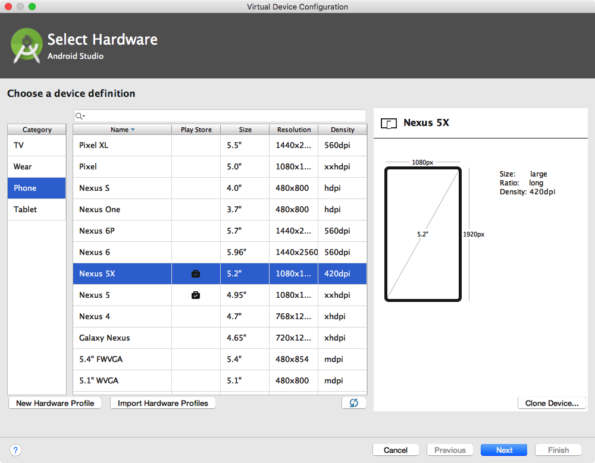
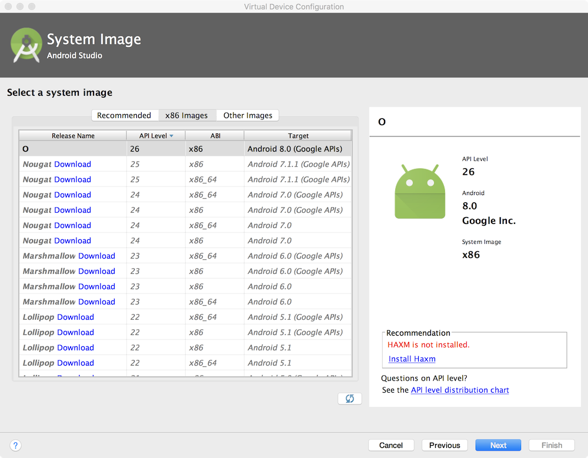

# Android Studio 的安装与配置

## 运行环境:

1. 操作系统: macOS 10.13/Windows 7/Windows 10
1. 引擎: cocos2d-x v3.16
1. IDE: Android Studio 2.3.3

## 安装步骤:

1. 从Cocos2d-x官网下载cocos2d-x v3.16, 解压. 为后续叙述方便,将 cocos2d-x 文件夹目录记为 `COCOS2DX_HOME`
1. 下载安装 Android Studio v2.3.3, 由于 Android 开发者官网国内访问缓慢, 可以选择从[Android Studio 中文社区](http://www.android-studio.org/index.php/download)下载对应版本.
1. 完成 Android Studio 安装, 进入欢迎界面, 选择 `Import project(Eclipse ADT, Gradle, etc.)`. 选择目录`COCOS2DX_HOME/tests/cpp-tests/proj.android-studio`, 点击 `OK` 进入IDE主界面.
1. 第一次导入 cocos2d-x 工程, 控制台会提示缺少组件, 点击提示下方的链接, 下载安装即可. 提示可能如下: 
    ```
    Gradle sync failed: Failed to find target with hash string 'android-14' in ...
    Gradle sync failed: Failed to find Build Tools revision 25.0.0
    ```
1. 组件安装完成, 点击工具栏 `Run`, 进行编译运行, 编译过程可能会花费一点时间. 
1. 选择运行应用的设备, IDE将自动安装应用, 并控制应用展示主界面. 建议直接使用Android手机接入电脑作为设备, 进行测试. 这样应用会有较快的运行速度. 如果使用模拟器请下载ARM的Image进行模拟器的创建. 

## 模拟器的创建

1. 点击工具栏 `AVD Manager` 进入模拟器的管理界面. 
    
1. 在 `Android Virtual Device Manager` 界面左下角, 可以看到按钮 `Create Virtual Device...`, 点击进入 `Choose a device definition`页面, 选择设备, 此处选择只决定了尺寸和分辨率, 与设备中运行的系统无关. 此处选择 `Nexus 5X`, 选择后点击 `Next`, 进入选择系统镜像页面.
    
1. 在 `Select a system image` 界面, 选择系统镜像, 此处选择决定了设备的`API Level` 和 `ABI`. `API Level`代表了 Android 系统版本, 如 API Level 24, 代表 Android 7.0 系统. `ABI` 是与CPU相关的一个参数, Intel 处理器多为x86, 高通处理器 多为 ARM. 更多关于 ABI 的了解,参见官方文档 [ABI 管理](https://developer.android.google.cn/ndk/guides/abis.html?hl=zh-cn).
    
1. 选择完成, 点击 Next, 进入`Verify Configuration`, 点击 Finish 结束.

## FAQ

1. 如何使用 x86 ABI 的模拟器运行 cocos2d-x 的 cpp-tests 项目?
    - 在项目中找到 `gradle.properties` 文件, 将 `PROP_APP_ABI=armeabi` 修改为 `PROP_APP_ABI=x86`, 点击提示中的 `Sync Now`, 完成后重新编译运行.